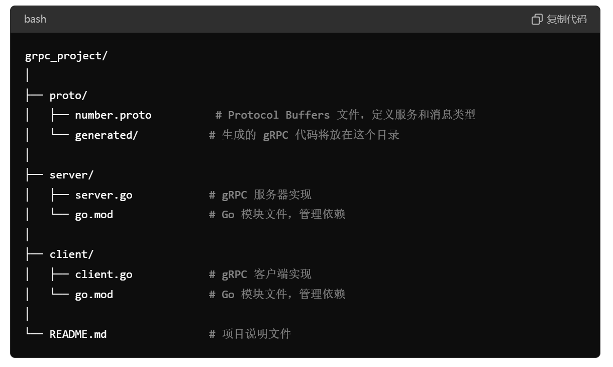

gRPC（gRPC Remote Procedure Calls）是一个由Google开发的高性能、开源的远程过程调用（RPC）框架。它允许客户端和服务器之间在不同环境中通信，并且支持多种编程语言。gRPC基于HTTP/2协议和Protocol Buffers（protobuf）数据序列化格式，提供了可靠、高效的通信方式。

## gRPC的主要特点

1. **高性能**：
   - gRPC使用HTTP/2作为底层传输协议，支持多路复用、流控制、头部压缩等特性，提高了传输效率和性能。
2. **多语言支持**：
   - gRPC支持多种编程语言，包括C、C++、Java、Python、Go、Ruby、C#、Node.js、PHP、Objective-C、Swift、Dart、Kotlin等。
3. **多种通信模式**：
   - **简单RPC**：客户端发送请求，服务器返回响应（类似于HTTP的请求-响应模式）。
   - **服务器流式RPC**：客户端发送请求，服务器返回流式响应。
   - **客户端流式RPC**：客户端发送流式请求，服务器返回单一响应。
   - **双向流式RPC**：客户端和服务器之间进行双向流式通信。
4. **IDL（接口定义语言）**：
   - gRPC使用Protocol Buffers（protobuf）作为接口定义语言，定义服务和消息结构。Protobuf是一种高效的二进制序列化格式，便于传输和解析。
5. **自动代码生成**：
   - gRPC提供工具从.proto文件中生成客户端和服务器的代码，大大简化了开发工作。
6. **安全性**：
   - gRPC内置对TLS（传输层安全性）的支持，确保通信的安全性。
7. **扩展性**：
   - gRPC支持拦截器机制，可以在请求处理前后进行自定义逻辑的注入，便于扩展功能如日志记录、认证、限流等。

## gRPC工作原理

### 执行步骤

1. 调用客户端句柄，执行传递参数。

2. 调用本地系统内核发送网络消息。

3. 消息传递到远程主机，就是被调用的服务端。

4. 服务端句柄得到消息并解析消息。

5. 服务端执行被调用方法，并将执行完毕的结果返回给服务器句柄。

6. 服务器句柄返回结果，并调用远程系统内核。

7. 消息经过网络传递给客户端。

8. 客户端接受数据。


## 编写proto文件

### 基本语法

1. **语法版本**

   ```
   syntax = "proto3";  // 或者 "proto2"
   ```

2. **包名**

   ```
   package mypackage;
   ```

3. **导入其他proto文件**

   ```
   import "other.proto";
   ```

4. ##### 可选的 生成.go文件和.pb.go文件的位置

```
option go_package = "proto/number";
```

###    **1.消息类型定义**

消息类型是Proto文件的核心，用于定义数据结构。每个字段都有一个唯一的编号，用于标识字段数据。

```
message MyMessage {
    int32 id = 1;          // 整数字段
    string name = 2;       // 字符串字段
    bool is_active = 3;    // 布尔字段
    repeated string tags = 4; // 重复字段（数组）
    NestedMessage nested = 5; // 嵌套消息
}

message NestedMessage {
    string nested_field = 1;
}
```

字段类型可以是以下几种：

- `int32`, `int64`: 有符号整数
- `uint32`, `uint64`: 无符号整数
- `sint32`, `sint64`: 有符号整数（高效编码负数）
- `bool`: 布尔值
- `string`: 字符串
- `bytes`: 二进制数据
- 自定义消息类型

### 2. 枚举类型定义

枚举类型用于定义一组命名值。

```
enum MyEnum {
    UNKNOWN = 0;
    STARTED = 1;
    IN_PROGRESS = 2;
    COMPLETED = 3;
}
```

枚举的每个值都需要有一个唯一的编号。默认值通常为0。

### 3. 服务定义

服务定义用于定义RPC服务及其方法。每个RPC方法定义了请求类型和响应类型。

```
service MyService {
    rpc MyMethod (MyRequest) returns (MyResponse);
}

message MyRequest {
    int32 id = 1;
}

message MyResponse {
    string result = 1;
}
```

RPC方法包含以下部分：

- 方法名（如 `MyMethod`）
- 请求消息类型（如 `MyRequest`）
- 响应消息类型（如 `MyResponse`）


## 生成两个文件

### `number.pb.go`

这个文件是通过 `protoc` 工具生成的，主要包含 Protocol Buffers 的消息类型定义。这个文件包括以下内容：

包含 Protocol Buffers 的数据定义和处理逻辑。它定义了消息结构和序列化/反序列化方法。

1. **消息定义**：
   - 包含 `.proto` 文件中定义的消息类型。这些消息类型通常是用来描述数据结构的，比如请求和响应消息。
2. **序列化和反序列化功能**：
   - 包含用于序列化（将消息转换为二进制格式）和反序列化（将二进制数据转换回消息对象）的代码。
3. **协议字段**：
   - 定义了消息中的字段、字段类型以及字段的序号。


### `number_grpc.pb.go`

这个文件是通过 `protoc` 工具和 gRPC 插件生成的，包含 gRPC 服务的客户端和服务器端代码。这个文件包括以下内容：

包含 gRPC 服务的客户端和服务器代码。它定义了服务接口和方法的实现，用于与 gRPC 服务进行通信。

1. **服务定义**：
   - 定义了 `.proto` 文件中声明的 gRPC 服务（例如，服务的接口、方法）。
2. **客户端和服务器代码**：
   - 包含客户端和服务器的代码生成，这些代码提供了与服务交互的函数和方法。
3. **方法实现**：
   - 包含用于调用 gRPC 服务方法的接口和相关实现代码。


### 使用场景

- 微服务架构：gRPC非常适合微服务之间的高效通信。
- 移动应用：由于gRPC的高性能和低带宽消耗，适合移动应用的数据同步和通信。
- 分布式系统：gRPC的流式通信和多路复用特性，适合分布式系统中的实时数据传输。

## go实现服务端客户端

### 目录结构



### 环境准备

1. **安装Go**：确保你已经安装了Go语言开发环境，可以通过以下命令检查安装情况：

   ```
   go version
   ```

2. **安装Protobuf编译器**：gRPC使用Protocol Buffers作为接口定义语言。可以从[protobuf releases](https://github.com/protocolbuffers/protobuf/releases)下载并安装。

3. **安装gRPC和Protobuf插件**：

   ```
   go install google.golang.org/protobuf/cmd/protoc-gen-go@latest
   go install google.golang.org/grpc/cmd/protoc-gen-go-grpc@latest
   ```

4. **将Go的bin目录添加到系统路径**：

   ```
   export PATH="$PATH:$(go env GOPATH)/bin"
   ```

### 定义gRPC服务

1. 创建一个目录结构：

   ```
   mkdir -p grpc_example
   cd grpc_example
   mkdir -p proto
   ```

2. 创建一个`proto/hello.proto`文件，定义服务和消息：

   ```
   syntax = "proto3";
   
   package hello;
   
   option go_package = "protos/example";
   
   service HelloService {
       rpc SayHello (HelloRequest) returns (HelloResponse);
   }
   
   message HelloRequest {
       string name = 1;
   }
   
   message HelloResponse {
       string message = 1;
   }
   ```

3. 在`protoc/generate`目录下生成Go代码：

   ```
   protoc --go_out=. --go-grpc_out=. proto/hello.proto
   ```

### 实现gRPC服务器

1. 创建一个名为`server`的目录，并在其中创建`main.go`文件：

   ```
   mkdir -p server
   cd server
   touch main.go
   ```

2. 在`main.go`中实现服务器：

   **pb是给引用的包别名，pb结构应该”项目目录/proto目录/子目录（存放的生成的.go文件）“**

   ```
   package main
   
   import (
       "context"
       "fmt"
       "log"
       "net"
   
       pb "grpc_example/proto"// 
   
       "google.golang.org/grpc"
       "google.golang.org/grpc/reflection"
   )
   
   const (
       port = ":50051"
   )
   
   type server struct {
       pb.UnimplementedHelloServiceServer
   }
   
   func (s *server) SayHello(ctx context.Context, in *pb.HelloRequest) (*pb.HelloResponse, error) {
       return &pb.HelloResponse{Message: "Hello, " + in.Name}, nil
   }
   
   func main() {
       lis, err := net.Listen("tcp", port)
       if err != nil {
           log.Fatalf("failed to listen: %v", err)
       }
       s := grpc.NewServer()
       pb.RegisterHelloServiceServer(s, &server{})
       reflection.Register(s)
       fmt.Printf("Server is listening on port %s\n", port)
       if err := s.Serve(lis); err != nil {
           log.Fatalf("failed to serve: %v", err)
       }
   }
   ```

### 实现gRPC客户端

1. 创建一个名为`client`的目录，并在其中创建`main.go`文件：

   ```
   mkdir -p client
   cd client
   touch main.go
   ```

2. 在`main.go`中实现客户端：

   ```
   package main
   
   import (
       "context"
       "log"
       "os"
       "time"
   
       pb "grpc_example/proto"
   
       "google.golang.org/grpc"
   )
   
   const (
       address     = "localhost:50051"
       defaultName = "world"
   )
   
   func main() {
       conn, err := grpc.Dial(address, grpc.WithInsecure(), grpc.WithBlock())
       if err != nil {
           log.Fatalf("did not connect: %v", err)
       }
       defer conn.Close()
       c := pb.NewHelloServiceClient(conn)
   
       name := defaultName
       if len(os.Args) > 1 {
           name = os.Args[1]
       }
       ctx, cancel := context.WithTimeout(context.Background(), time.Second)
       defer cancel()
       r, err := c.SayHello(ctx, &pb.HelloRequest{Name: name})
       if err != nil {
           log.Fatalf("could not greet: %v", err)
       }
       log.Printf("Greeting: %s", r.GetMessage())
   }
   ```

### 运行示例

1. 启动服务器：

   ```
   cd grpc_example/server
   go run main.go
   ```

   你应该会看到服务器正在监听50051端口的消息：

   ```
   Server is listening on port :50051
   ```

2. 运行客户端：

   打开另一个终端，运行以下命令：

   ```
   cd grpc_example/client
   go run main.go Alice
   ```

   你应该会看到客户端收到的问候消息：

   ```
   Greeting: Hello, Alice
   ```