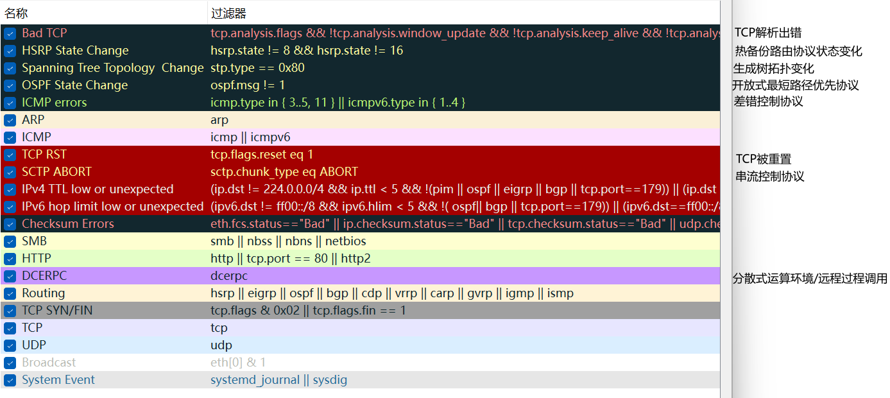

# **Wireshark** 

### 主要功能

1. **数据包捕获**：Wireshark可以实时捕获从网络接口流过的所有数据包，并且可以对这些数据包进行保存和离线分析。
2. **协议分析**：Wireshark支持上百种网络协议，包括TCP/IP、HTTP、DNS、FTP等。它可以解析这些协议的数据包，展示详细的协议层次信息。
3. **数据包过滤**：Wireshark提供强大的过滤功能，用户可以使用显示过滤器和捕获过滤器来选择感兴趣的数据包。例如，用户可以过滤出特定IP地址的数据包，或只查看特定协议的数据包。
4. **数据包解码**：Wireshark可以对捕获的数据包进行解码，展示原始的字节流，并将其转换为人类可读的格式。
5. **统计分析**：Wireshark提供各种统计功能，包括流量图、协议层统计、会话分析等，帮助用户更好地理解网络流量的特征和趋势。
6. **专家系统**：Wireshark包含一个专家系统，可以自动检测并标记潜在的问题，如重传、分片错误、协议异常等。

### 使用场景

1. **网络故障排除**：网络管理员可以使用Wireshark捕获和分析网络流量，找出网络中的瓶颈、丢包、延迟等问题。
2. **安全分析**：安全专家可以使用Wireshark分析网络流量，检测入侵行为、恶意流量、数据泄露等安全事件。
3. **协议开发**：开发人员可以使用Wireshark调试和测试新开发的网络协议，确保其符合规范和预期行为。
4. **教育培训**：Wireshark是学习网络协议和网络分析的优秀工具，许多网络课程和培训都使用Wireshark作为教学工具。

### 界面和使用

Wireshark提供图形用户界面（GUI）和命令行界面（CLI）两种操作方式。常见的使用步骤如下：

1. **选择网络接口**：启动Wireshark后，用户需要选择一个网络接口（如以太网、Wi-Fi）来捕获数据包。
2. **开始捕获**：点击“开始”按钮，Wireshark会开始捕获数据包，并在界面中实时显示捕获的数据包。
3. **使用过滤器**：在捕获过程中或捕获后，用户可以使用显示过滤器来筛选感兴趣的数据包。
4. **查看和分析数据包**：点击某个数据包，Wireshark会在下方窗口中显示该数据包的详细信息，包括各层协议头和数据内容。
5. **保存捕获文件**：用户可以将捕获的数据包保存为文件（如.pcap格式），以便后续分析或共享。

### 常见问题和注意事项

1. **权限问题**：捕获网络数据包通常需要管理员权限，特别是在UNIX/Linux系统中。
2. **隐私和法律问题**：在捕获和分析网络流量时，可能会涉及用户隐私和法律问题。在使用Wireshark进行网络分析时，必须遵守相关法律法规和公司的政策。
3. **性能影响**：实时捕获大量数据包可能会影响系统性能，特别是在高流量网络环境中。可以考虑使用捕获过滤器减少捕获的数据量。

# 分析步骤

Wireshark抓取的数据包可以通过多种方式进行分析，以下是详细的分析步骤和方法：

### 1. **捕获数据包**

- **选择网络接口**：启动Wireshark后，选择要监控的网络接口（如以太网或Wi-Fi）。
- **开始捕获**：点击“开始捕获”按钮，Wireshark会开始捕获通过该接口的所有数据包。
- **停止捕获**：当捕获到足够的数据包时，点击“停止捕获”按钮。

### 2. **查看数据包**

- **数据包列表面板**：捕获的数据包会显示在Wireshark的顶部面板中，每个数据包会显示时间戳、源IP、目的IP、协议类型和其他摘要信息。
- **数据包详细信息面板**：选中某个数据包后，Wireshark会在中间面板中显示该数据包的详细信息，包括各层协议头（如以太网、IP、TCP/UDP、应用层协议等）。
- **数据包字节视图面板**：底部面板显示选中数据包的原始字节流及其十六进制和ASCII表示。

### 3. **使用显示过滤器**

显示过滤器可以帮助用户筛选和聚焦感兴趣的数据包。常用的过滤器语法包括：

- **IP地址过滤**：`ip.addr == 192.168.1.1`
- **协议过滤**：`http`、`tcp`、`udp`等
- **端口过滤**：`tcp.port == 80` 或 `udp.port == 53`
- **组合条件**：`ip.src == 192.168.1.1 && tcp.port == 80`

### 4. **协议分析**

Wireshark支持上百种协议，并且会自动解析这些协议的数据包。通过查看数据包详细信息面板，用户可以了解各层协议的具体内容。例如：

- **以太网层**：源MAC地址、目的MAC地址、以太网类型等
- **网络层**：源IP地址、目的IP地址、IP包长度、TTL、协议等
- **传输层**：源端口、目的端口、序列号、确认号、窗口大小等
- **应用层**：HTTP请求/响应、DNS查询/响应、FTP命令等

### 5. **统计和图表**

Wireshark提供了多种统计和图表工具，帮助用户更直观地理解网络流量特征：

- **协议层统计**：`统计` -> `协议层次`
- **流量图**：`统计` -> `IO图`
- **会话分析**：`统计` -> `会话`
- **端点统计**：`统计` -> `端点`
- **对话统计**：`统计` -> `对话`

### 6. **故障排除和安全分析**

- **重传和丢包**：查看TCP层是否存在重传（Retransmissions）和丢包（Lost packets）情况。
- **延迟和抖动**：分析网络延迟（Latency）和抖动（Jitter），特别是在实时通信应用中。
- **异常流量检测**：使用Wireshark的专家系统（Expert Info），检测异常流量和协议违规情况。
- **入侵检测**：分析是否存在可疑的网络行为，如扫描、攻击、恶意流量等。

### 7. **保存和共享捕获文件**

- **保存捕获文件**：将捕获的数据包保存为文件（如.pcap格式）以便后续分析。
- **共享捕获文件**：捕获文件可以在不同工具和平台之间共享，以便团队协作和进一步分析。

### 8. **使用命令行工具**

Wireshark提供了命令行工具`tshark`，可以用于自动化和批量分析：

- **捕获数据包**：`tshark -i eth0 -w capture.pcap`
- **应用过滤器**：`tshark -r capture.pcap -Y "http"`
- **提取字段**：`tshark -r capture.pcap -T fields -e ip.src -e ip.dst`

### 总结

使用Wireshark进行数据包分析需要一定的网络知识和经验，但其强大的功能和灵活性使其成为网络分析和故障排除的不可或缺的工具。通过熟练掌握Wireshark的各种功能和技巧，用户可以深入了解网络流量的细节，快速定位和解决网络问题。

# 分析技巧

### 1. **熟悉显示过滤器**

显示过滤器是Wireshark中最强大的工具之一，熟练使用过滤器可以快速定位感兴趣的数据包。

- 基本过滤器

  ：

  - 按协议过滤：`http`, `tcp`, `udp`, `dns`
  - 按IP地址过滤：`ip.addr == 192.168.1.1`
  - 按端口过滤：`tcp.port == 80` 或 `udp.port == 53`

- 组合条件

  ：

  - 与操作：`ip.src == 192.168.1.1 && tcp.port == 80`
  - 或操作：`http || dns`

- **排除条件**：`!(tcp.port == 80)`

### 2. **使用捕获过滤器**

捕获过滤器在捕获数据包之前应用，减少捕获的数据量，提高捕获效率。

- **按协议捕获**：`tcp`, `udp`, `icmp`
- **按IP地址捕获**：`host 192.168.1.1`
- **按端口捕获**：`port 80`

### 3. **标记和注释**

对关键数据包进行标记和添加注释，可以帮助在分析过程中快速找到重要数据包。

- **标记数据包**：右键点击数据包，选择“标记数据包”。
- **添加注释**：右键点击数据包，选择“注释数据包”。

### 4. **使用颜色规则**

颜色规则可以帮助快速识别不同类型的数据包或潜在问题。

- **设置颜色规则**：`查看` -> `着色规则`

- 常用颜色规则

  ：

  - TCP重传：红色
  - HTTP请求/响应：绿色
  - DNS查询/响应：蓝色

### 5. **关注专家信息**

Wireshark的专家信息提供对潜在问题的快速检测和提示。

- **查看专家信息**：`分析` -> `专家信息`
- **常见警告和错误**：重传（Retransmissions）、重复ACK（Duplicate ACKs）、零窗口（Zero Window）

### 6. **利用统计工具**

Wireshark提供丰富的统计工具，帮助识别流量模式和趋势。

- **协议层次统计**：`统计` -> `协议层次`
- **会话统计**：`统计` -> `会话`
- **流量图**：`统计` -> `IO图`
- **端点统计**：`统计` -> `端点`

### 7. **解密加密流量**

如果有解密密钥，Wireshark可以解密一些常见的加密协议，如HTTPS、WPA等。

- **HTTPS解密**：提供SSL密钥文件
- **Wi-Fi解密**：提供WPA/WPA2预共享密钥

### 8. **重组数据流**

重组TCP流可以帮助查看完整的应用层数据，如HTTP请求和响应。

- **重组TCP流**：右键点击数据包，选择“跟踪TCP流”

### 9. **使用命令行工具**

`tshark`是Wireshark的命令行版本，适用于自动化和脚本化分析。

- **捕获数据包**：`tshark -i eth0 -w capture.pcap`
- **应用过滤器**：`tshark -r capture.pcap -Y "http"`
- **提取字段**：`tshark -r capture.pcap -T fields -e ip.src -e ip.dst`

### 10. **保存和共享捕获文件**

保存捕获文件（.pcap格式）可以方便后续分析和团队协作。

- **保存捕获文件**：`文件` -> `保存为`
- **导出特定数据包**：使用显示过滤器筛选出感兴趣的数据包，然后导出这些数据包。

# 默认颜色规则示例

