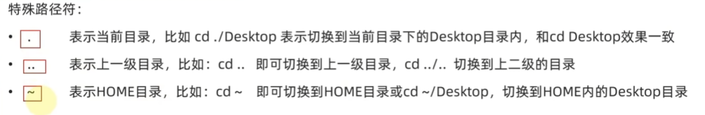
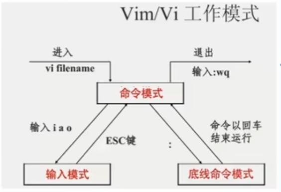

# 第一节 Linux目录结构

## 1.目录结构

只有一个根目录/，所有文件都在他下面。B+树。

/: 根目录。所有文件和目录都从这里开始。

/bin: 存放基本命令的二进制可执行文件，如 ls、cp、mv 等。这些命令在单用户模式下也可以使用。

/etc: 系统配置文件目录。所有的系统级配置文件都在这里，比如 fstab、hosts、network 等。

/opt: 可选软件包安装目录。通常用于安装附加的、非标准的软件包。

/home: 用户主目录。每个用户都有一个以用户名命名的子目录，用于存储个人文件和配置。

/var: 可变数据文件目录。包含日志文件、邮件队列、打印机临时文件、锁文件、状态文件等。

/var/log: 存放日志文件。
/var/mail: 存放用户邮件。
/var/spool: 存放任务队列数据。

## 2.路径表达形式

/var/spool

# 第二节 Linux命令入门

## 1 Linux命令基础

command  [-options]  [parameter]

options控制命令的行为细节

parameter控制命令的指向目标

## 2 ls命令入门

ls 命令是 Linux 和 Unix 系统中最常用的命令之一，用于列出目录内容。它显示指定目录下的文件和子目录，默认情况下列出当前工作目录的内容。

## 3ls命令的参数和选项

**ls [选项] [文件或目录]**

-l：长格式显示文件信息，包括文件权限、所有者、文件大小和修改时间。
-a：显示所有文件，包括隐藏文件（以 . 开头的文件）。
-h：与 -l 选项一起使用，以人类可读的格式显示文件大小（如 1K、234M、2G）。
-R：递归列出子目录中的内容。
-t：按修改时间排序，最新的文件排在最前面。
-r：反转排序顺序（默认是按字母顺序）。
-S：按文件大小排序。
**--color：为输出添加颜色，以区分不同类型的文件（许多系统默认启用此选项）。**

蓝色：目录
绿色：可执行文件
红色：压缩文件
淡蓝色：符号链接
黄色：设备文件

# 第三节 目录切换相关命令

## 1 切换工作目录 cd

cd（Change Directory）命令用于更改当前工作目录。

cd [目录路径]

cd ..   切换到上一级目录

cd      切换到用户主目录

cd /    切换到根目录

## 2展示当前工作目录 pwd

pwd（Print Working Directory）命令用于显示当前工作目录的完整路径。

pwd    显示当前工作目录

## 3 特殊路径符

# 第四节 创建目录命令

## mkdir 命令

是 Linux 和 Unix 系统中用于创建目录的命令。通过 mkdir 命令，可以在指定路径下创建一个或多个新的目录。

mkdir [选项] 目录名

-p：创建嵌套目录。如果中间目录不存在，会自动创建。
-v：显示命令执行的详细信息（verbose），输出每个目录的创建情况。
-m：设置新建目录的权限（mode），格式如 -m 755。

# 第五节 文件操作相关命令

## **touch 命令**

用于创建空文件或更新已有文件的时间戳。

touch [选项] 文件名

-a：只修改访问时间。
-m：只修改修改时间。
-t：使用指定时间而不是当前时间，格式为 [[CC]YY]MMDDhhmm[.ss]。
-c：如果文件不存在，则不创建文件。

## **cat（concatenate）命令**

用于显示文件内容、合并文件和创建文件。

cat [选项] [文件]...

-n：对输出的所有行编号。
-b：对非空输出行编号。
-s：压缩空行。
-E：在每行结束处显示 $。

创建新文件：cat > newfile.txt 然后输入文本，按 Ctrl+D 结束。

## more 是一个分页查看器

用于在终端中分页显示文件内容。

more [选项] 文件

-d：显示 Press space to continue, 'q' to quit. 提示。
-c：清屏显示每一页内容，而不是滚动显示。
-s：压缩多个空行成一个空行。

基本操作：

空格：显示下一页。
Enter：显示下一行。
b 或 Ctrl + B：返回上一页。
q：退出 more。
/string：向前搜索字符串。
n：重复前一个搜索。

# 第六节  文件操作命令2

## cp 命令

用于复制文件或目录

cp [选项] 源文件 目标文件 

cp [选项] 源文件... 目标目录

-r 或 -R：递归复制目录及其内容。
-i：覆盖文件前提示确认。
-u：只在源文件比目标文件新或目标文件不存在时复制。
-v：显示详细的复制过程。
-p：保留文件属性（如时间戳、权限等）。

## mv命令

用于移动或重命名文件和目录

mv [选项] 源文件 目标文件 

mv [选项] 源文件... 目标目录

-i：覆盖文件前提示确认。
-u：只在源文件比目标文件新或目标文件不存在时移动。
-v：显示详细的移动过程。

## rm 命令

用于删除文件和目录

rm [选项] 文件...

-r 或 -R：递归删除目录及其内容。
-i：删除文件前提示确认。
-f：强制删除，不提示确认。
-v：显示详细的删除过程

# 第七节 查找命令

## which 命令

用于查找并显示命令的绝对路径

它在用户的 $PATH 环境变量中搜索给定的命令，并返回第一个匹配的路径。

which [选项] 命令

-a：显示所有匹配的路径，而不仅仅是第一个。

## find命令

用于在目录树中搜索文件和目录

 find [路径...] [表达式]

-name：按文件名搜索，支持通配符  如*test。
-iname：按文件名搜索（忽略大小写），支持通配符。
-type：按文件类型搜索，例如 f（文件）、d（目录）。
-size：按文件大小搜索，例如 +100M（大于100MB）、-50k（小于50KB）。
-mtime：按修改时间搜索，例如 -7（7天内修改过的文件）、+30（30天前修改的文件）。
-exec：对匹配的文件执行指定的命令。

执行命令：

find /path/to/search -name "*.log" -exec rm {} \;

# 第八节   grep wc 管道符

## grep命令

搜索文本文件中的特定模式（字符串或正则表达式）

grep [选项] 模式 [文件...]

-i：忽略大小写。
-v：反向匹配，只显示不包含匹配模式的行。
-r 或 -R：递归搜索目录。
-n：显示匹配行的行号。
-l：只显示包含匹配模式的文件名。
-c：显示每个文件中匹配行的数量。
-E：使用扩展正则表达式。
-o：只显示匹配的部分。

如递归搜索目录：

grep -r "search_string" /path/to/directory

## wc 命令

用于计算文件中的字数、行数和字符数。

wc [选项] [文件...]

-l：显示行数。
-w：显示字数。
-c：显示字节数。
-m：显示字符数。

## 管道符（|）

用于将一个命令的输出作为另一个命令的输入

command1 | command2

如 将 ls 的输出传递给 grep： 

ls -l | grep "filename"

# 第九节 echo tail 重定向符

## echo 命令

用于在终端显示一段文本或变量的值

它是最基本的输出命令之一，常用于脚本编写和命令行操作中。

echo [选项] [字符串...]

-n：不输出结尾的换行符。
-e：启用解释反斜杠转义字符。

``:当成命令输出，执行命令。

如输出变量的值：

name="Alice"
echo "Hello, $name!"

## tail 命令

用于显示文件的尾部内容

常用于查看日志文件的最新部分。它还支持动态跟踪文件的变化。

基本用法

tail [选项] [文件...]

-n：指定显示的行数。例如，-n 20 表示显示最后20行。
-f：实时跟踪文件内容的变化，常用于监控日志文件。
-c：按字节数显示内容。例如，-c 100 表示显示最后100个字节。
-q：安静模式，显示多文件时不输出文件名。
-v：详细模式，总是输出文件名。

如显示文件的最后10行（默认行为）：

tail filename.txt

## 重定向符

用于将命令的输出或输入重定向到文件或另一个命令。

常用的重定向符包括 >、>> 和 <。

">" 将输出重定向到文件（覆盖文件内容）。

">>" 将输出追加到文件（不覆盖文件内容）。

"<" 将文件内容作为命令的输入。

2>：将错误输出重定向到文件。
2>>：将错误输出追加到文件。
&>：将标准输出和错误输出重定向到同一个文件。
&>>：将标准输出和错误输出追加到同一个文件。

如：

echo "Hello, World!" > output.txt 将输出重定向到文件

echo "Hello again!" >> output.txt 将输出追加到文件

cat < input.txt 将文件内容作为命令的输入

# 第十节 vim编辑器

vim（Vi IMproved）是一个功能强大的文本编辑器，是 vi 编辑器的增强版本。它提供了丰富的编辑功能，并支持多种编程语言的语法高亮显示。

vim [选项] [文件]

## 工作模式

正常模式（Normal Mode）：默认模式，用于浏览和编辑文本。
插入模式（Insert Mode）：用于输入文本。
命令模式（Command Mode）：用于执行保存、退出、查找等命令。

### 正常模式

在启动 vim 后，默认进入正常模式。在此模式下，您可以执行以下操作：

**移动光标：**

h：左移光标
j：下移光标
k：上移光标
l：右移光标

**进入插入模式：**

i：在光标前插入
a：在光标后插入
o：在当前行下方新建一行并插入
I：在行首插入
A：在行尾插入
O：在当前行上方新建一行并插入

**删除文本：**

x：删除光标所在字符
dd：删除整行
dw：删除到下一个单词的开头

**复制和粘贴：**

yy：复制整行
p：在光标后粘贴
P：在光标前粘贴

**撤销和重做：**

u：撤销上一步操作
Ctrl + r：重做撤销的操作

### 插入模式

在正常模式下按 i、a、o 等键进入插入模式。在插入模式下，您可以输入文本。按 Esc 键返回到正常模式。

**保存文件：**

:w：保存文件
:w filename：另存为文件
**退出 vim：**

:q：退出（如果文件已修改则无法退出）
:q!：强制退出（不保存修改）
:wq：保存并退出
**查找和替换：**

/pattern：向前查找 pattern
?pattern：向后查找 pattern
:s/old/new/g：在当前行替换 old 为 new
:%s/old/new/g：在整个文件中替换 old 为 new
