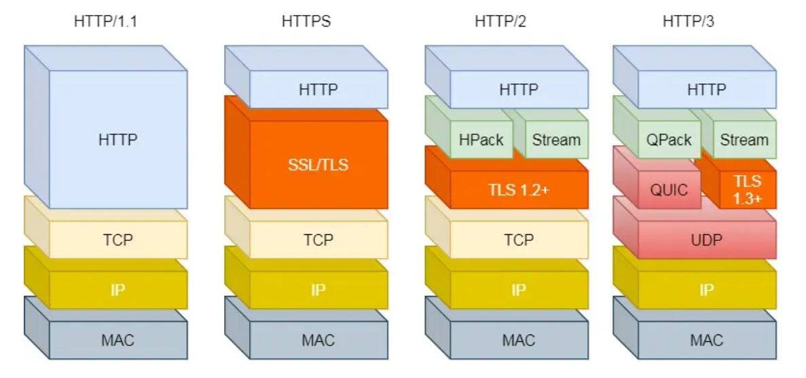

# HTTP协议

HTTP（HyperText Transfer Protocol，超文本传输协议）是用于从万维网（WWW）服务器传输超文本到本地浏览器的传送协议。它基于客户端-服务器架构，常用于浏览器与服务器之间的通信。



## HTTP协议的基本概念

1. **客户端-服务器模型**：HTTP是一个基于请求和响应的协议。客户端（通常是浏览器）发送请求给服务器，服务器处理请求后返回响应。
2. **无状态协议**：HTTP是无状态的，这意味着每个请求都是独立的，服务器不会保留任何之前请求的状态。
3. **请求和响应**：HTTP通信包括两个主要部分：请求（由客户端发出）和响应（由服务器返回）。

## HTTP请求

HTTP请求由以下几部分组成：

1. 请求行

   ：包含请求方法、URL和HTTP版本。例如：

   ```
   GET /index.html HTTP/1.1
   ```

2. **请求头**：包含一些客户浏览器传给服务器的信息，例如主机、浏览器类型、语言等。常见的请求头包括`Host`、`User-Agent`、`Accept`等。

3. **空行**：用于分隔请求头和请求体。

4. **请求体**：包含需要发送给服务器的数据，通常在POST、PUT等方法中使用。

### 常见的HTTP请求方法

1. **GET**：请求获取指定资源，通常用于获取数据。
2. **POST**：向指定资源提交数据进行处理，通常用于提交表单。
3. **PUT**：上传指定资源的最新内容。
4. **DELETE**：删除指定的资源。
5. **HEAD**：与GET类似，但只返回响应头，不返回响应体。
6. **OPTIONS**：返回服务器支持的HTTP方法。
7. **PATCH**：对资源进行部分修改。

## HTTP请求报文

HTTP请求报文是客户端（通常是浏览器）向服务器发送的，用于请求资源或执行操作。

### 请求报文的结构

1. **请求行**：包含请求方法、请求的URI和HTTP版本。
2. **请求头部**：包含关于客户端环境和请求体的元信息。
3. **空行**：用来分隔请求头部和请求体。
4. **请求体**：包含请求的内容（可选）。

### 请求报文示例

```
GET /index.html HTTP/1.1
Host: www.example.com
User-Agent: Mozilla/5.0 (Windows NT 10.0; Win64; x64)
Accept: text/html,application/xhtml+xml,application/xml;q=0.9
Accept-Language: en-US,en;q=0.5
Accept-Encoding: gzip, deflate, br
Connection: keep-alive
```

1. **请求行**：
   - `GET`：请求方法，表示请求获取资源。
   - `/index.html`：请求的URI。
   - `HTTP/1.1`：HTTP版本。
2. **请求头部**：
   - `Host: www.example.com`：指定服务器的主机名。
   - `User-Agent: Mozilla/5.0 (Windows NT 10.0; Win64; x64)`：客户端的用户代理信息。
   - `Accept: text/html,application/xhtml+xml,application/xml;q=0.9`：客户端接受的MIME类型。
   - `Accept-Language: en-US,en;q=0.5`：客户端接受的语言。
   - `Accept-Encoding: gzip, deflate, br`：客户端接受的内容编码。
   - `Connection: keep-alive`：保持连接。
3. **空行**：分隔头部和主体。
4. **请求体**：GET请求通常没有请求体，但POST请求等可能包含数据。

## HTTP响应

HTTP响应也由以下几部分组成：

1. **状态行**

   ：包含HTTP版本、状态码和状态描述。例如：

   ```
   HTTP/1.1 200 OK
   ```

2. **响应头**：包含一些服务器传给客户端的信息，例如日期、服务器类型、内容类型等。常见的响应头包括`Content-Type`、`Content-Length`、`Set-Cookie`等。

3. **空行**：用于分隔响应头和响应体。

4. **响应体**：包含请求的资源，通常是HTML文档、图像、JSON数据等。

### 常见的HTTP状态码

1. 1xx（信息性状态码）

   ：表示请求已被接收，需要继续处理。

   - 100 Continue

2. 2xx（成功状态码）

   ：表示请求已成功被服务器接收、理解并接受。

   - 200 OK
   - 201 Created

3. 3xx（重定向状态码）

   ：表示请求需要进一步操作以完成。

   - 301 Moved Permanently
   - 302 Found

4. 4xx（客户端错误状态码）

   ：表示请求包含错误或客户端需进行某些处理。

   - 400 Bad Request
   - 401 Unauthorized
   - 404 Not Found

5. 5xx（服务器错误状态码）

   ：表示服务器在处理请求时发生了错误。

   - 500 Internal Server Error
   - 502 Bad Gateway

## HTTP响应报文

HTTP响应报文是服务器向客户端返回的，包含请求资源的状态和数据。

### 响应报文的结构

1. **状态行**：包含HTTP版本、状态码和状态描述。
2. **响应头部**：包含关于服务器和响应体的元信息。
3. **空行**：用来分隔响应头部和响应体。
4. **响应体**：包含返回的资源数据。

### 响应报文示例

```
HTTP/1.1 200 OK
Date: Wed, 21 Oct 2020 07:28:00 GMT
Server: Apache/2.4.1 (Unix)
Last-Modified: Tue, 15 Nov 2020 12:45:26 GMT
Content-Type: text/html
Content-Length: 123

<html>
<head>
    <title>Example Page</title>
</head>
<body>
    <h1>Hello, World!</h1>
</body>
</html>
```

1. **状态行**：
   - `HTTP/1.1`：HTTP版本。
   - `200`：状态码，表示请求成功。
   - `OK`：状态描述。
2. **响应头部**：
   - `Date: Wed, 21 Oct 2020 07:28:00 GMT`：响应生成的日期和时间。
   - `Server: Apache/2.4.1 (Unix)`：服务器软件的信息。
   - `Last-Modified: Tue, 15 Nov 2020 12:45:26 GMT`：资源的最后修改时间。
   - `Content-Type: text/html`：响应内容的类型。
   - `Content-Length: 123`：响应体的长度。
3. **空行**：分隔头部和主体。
4. **响应体**：包含返回的HTML内容。


# HTTP1.1协议

HTTP/1.1 是一种无状态的应用层协议，广泛用于万维网上的通信。它使用文本格式来传输数据，分为请求报文和响应报文两种类型。以下是对 HTTP/1.1 报文格式的详细介绍。

## 请求报文

HTTP 请求报文由以下几个部分组成：

1. **请求行（Request Line）**
2. **请求头部（Request Headers）**
3. **空行（CRLF）**
4. **消息主体（Message Body，可选）**

### 1. 请求行（Request Line）

请求行包含三个部分：请求方法、请求 URI 和 HTTP 版本。格式如下：

```
<method> <request-URI> <HTTP-version>
```

示例：

```
GET /index.html HTTP/1.1
```

- **请求方法**：常见的有 GET、POST、PUT、DELETE、HEAD 等。
- **请求 URI**：指示请求的资源路径，如 `/index.html`。
- **HTTP 版本**：这里是 `HTTP/1.1`。

### 2. 请求头部（Request Headers）

请求头部包含若干头字段，每个头字段由名称和值组成，中间用冒号和空格分隔。常见的请求头字段包括 `Host`、`User-Agent`、`Accept`、`Content-Type` 等。格式如下：

```
<field-name>: <field-value>
```

示例：

```
Host: www.example.com
User-Agent: Mozilla/5.0 (Windows NT 10.0; Win64; x64) AppleWebKit/537.36 (KHTML, like Gecko) Chrome/58.0.3029.110 Safari/537.3
Accept: text/html,application/xhtml+xml,application/xml;q=0.9,image/webp,*/*;q=0.8
```

### 3. 空行（CRLF）

请求头部和消息主体之间必须有一个空行。这个空行仅由一个 CRLF（回车和换行）组成，表示头部结束。

### 4. 消息主体（Message Body，可选）

消息主体是可选的，通常在 POST 或 PUT 请求中包含提交的数据。例如：

```
name=John&age=30
```

## 响应报文

HTTP 响应报文由以下几个部分组成：

1. **状态行（Status Line）**
2. **响应头部（Response Headers）**
3. **空行（CRLF）**
4. **响应主体（Response Body）**

### 1. 状态行（Status Line）

状态行包含三个部分：HTTP 版本、状态码和状态短语。格式如下：

```
<HTTP-version> <status-code> <reason-phrase>
```

示例：

```
HTTP/1.1 200 OK
```

- **HTTP 版本**：这里是 `HTTP/1.1`。
- **状态码**：表示响应结果的三位数字，如 `200` 表示成功，`404` 表示未找到。
- **状态短语**：对状态码的简短描述，如 `OK` 表示成功，`Not Found` 表示未找到。

### 2. 响应头部（Response Headers）

响应头部包含若干头字段，每个头字段由名称和值组成，中间用冒号和空格分隔。常见的响应头字段包括 `Date`、`Content-Type`、`Content-Length`、`Server` 等。格式如下：

```
<field-name>: <field-value>
```

示例：

```
Date: Mon, 27 Jul 2024 12:28:53 GMT
Content-Type: text/html; charset=UTF-8
Content-Length: 138
Server: Apache/2.4.1 (Unix)
```

### 3. 空行（CRLF）

响应头部和响应主体之间必须有一个空行。这个空行仅由一个 CRLF（回车和换行）组成，表示头部结束。

### 4. 响应主体（Response Body）

响应主体包含实际的响应数据，如 HTML 文件、图像等。示例：

```
<!DOCTYPE html>
<html>
<head>
    <title>Example</title>
</head>
<body>
    <h1>Hello, World!</h1>
</body>
</html>
```

## 示例

以下是一个完整的 HTTP 请求和响应示例：

### HTTP 请求

```
GET /index.html HTTP/1.1
Host: www.example.com
User-Agent: Mozilla/5.0 (Windows NT 10.0; Win64; x64) AppleWebKit/537.36 (KHTML, like Gecko) Chrome/58.0.3029.110 Safari/537.3
Accept: text/html,application/xhtml+xml,application/xml;q=0.9,image/webp,*/*;q=0.8
Accept-Language: en-US,en;q=0.5
Accept-Encoding: gzip, deflate
Connection: keep-alive
```

### HTTP 响应

```
HTTP/1.1 200 OK
Date: Mon, 27 Jul 2024 12:28:53 GMT
Content-Type: text/html; charset=UTF-8
Content-Length: 138
Server: Apache/2.4.1 (Unix)

<!DOCTYPE html>
<html>
<head>
    <title>Example</title>
</head>
<body>
    <h1>Hello, World!</h1>
</body>
</html>
```


# HTTP2协议

HTTP/2 是 HTTP/1.1 的继任者，旨在提高性能和效率。与 HTTP/1.1 的文本格式不同，HTTP/2 使用二进制格式传输数据，显著提高了传输效率和安全性。HTTP/2 引入了多个新特性，如多路复用、头部压缩、服务器推送等。

### HTTP/2 报文格式

HTTP/2 报文由帧（Frame）构成，每个帧都有一个固定的头部和可变的负载。常见的帧类型包括 DATA、HEADERS、PRIORITY、RST_STREAM、SETTINGS、PUSH_PROMISE、PING、GOAWAY、WINDOW_UPDATE 和 CONTINUATION。

#### 1. 帧的基本格式

每个帧都有固定的头部格式，由 9 个字节构成：

```
  0                   1                   2                   3
  0 1 2 3 4 5 6 7 8 9 0 1 2 3 4 5 6 7 8 9 0 1 2 3 4 5 6 7 8 9 0 1
 +-+-------------------------------------------------------------+
 | |                      Length (24)                            |
 +-+---------------+---------------------------------------------+
 |   Type (8)      |   Flags (8)   |
 +-+---------------+---------------------------------------------+
 |R|                 Stream Identifier (31)                      |
 +-+-------------------------------------------------------------+
 |                      Frame Payload (variable)                 |
 +---------------------------------------------------------------+
```

- **Length**：帧负载的长度，为 24 位（3 个字节），不包括帧头部的 9 个字节。
- **Type**：帧类型，为 8 位，定义了帧的类型，如 DATA、HEADERS 等。
- **Flags**：帧的标志位，为 8 位，特定于每种帧类型。
- **R**：保留位，1 位，必须为 0。
- **Stream Identifier**：流标识符，为 31 位，指示帧所属的流。

#### 2. 常见的帧类型

以下是 HTTP/2 的一些常见帧类型及其格式：

##### DATA 帧

用于传输消息的主体数据。

```
  0                   1                   2                   3
  0 1 2 3 4 5 6 7 8 9 0 1 2 3 4 5 6 7 8 9 0 1 2 3 4 5 6 7 8 9 0 1
 +-+-------------------------------------------------------------+
 | |                      Length (24)                            |
 +-+---------------+---------------------------------------------+
 |   Type (8)      |   Flags (8)   |
 +-+---------------+---------------------------------------------+
 |R|                 Stream Identifier (31)                      |
 +-+-------------------------------------------------------------+
 |Pad Length? (8)  |
 +---------------------------------------------------------------+
 |                            Data (*)                         ...
 +---------------------------------------------------------------+
 |                           Padding (*)                       ...
 +---------------------------------------------------------------+
```

- **Pad Length**：可选字段，如果设置了 PADDED 标志。
- **Data**：实际的数据负载。
- **Padding**：可选字段，用于填充数据。

##### HEADERS 帧

用于传输头部信息。

```
  0                   1                   2                   3
  0 1 2 3 4 5 6 7 8 9 0 1 2 3 4 5 6 7 8 9 0 1 2 3 4 5 6 7 8 9 0 1
 +-+-------------------------------------------------------------+
 | |                      Length (24)                            |
 +-+---------------+---------------------------------------------+
 |   Type (8)      |   Flags (8)   |
 +-+---------------+---------------------------------------------+
 |R|                 Stream Identifier (31)                      |
 +-+-------------------------------------------------------------+
 |Pad Length? (8)  |
 +-+-------------+-----------------------------------------------+
 |E|                 Stream Dependency? (31)                     |
 +-+-------------+-----------------------------------------------+
 |  Weight? (8)   |
 +-+-------------------------------------------------------------+
 |                   Header Block Fragment (*)                 ...
 +---------------------------------------------------------------+
 |                           Padding (*)                       ...
 +---------------------------------------------------------------+
```

- **Pad Length**：可选字段，如果设置了 PADDED 标志。
- **E**：保留位，表示流依赖性。
- **Stream Dependency**：可选字段，表示优先级依赖的流。
- **Weight**：可选字段，表示流的权重。
- **Header Block Fragment**：头部块的片段。
- **Padding**：可选字段，用于填充数据。

##### SETTINGS 帧

用于传输连接级别的配置参数。

```
  0                   1                   2                   3
  0 1 2 3 4 5 6 7 8 9 0 1 2 3 4 5 6 7 8 9 0 1 2 3 4 5 6 7 8 9 0 1
 +-+-------------------------------------------------------------+
 | |                      Length (24)                            |
 +-+---------------+---------------------------------------------+
 |   Type (8)      |   Flags (8)   |
 +-+---------------+---------------------------------------------+
 |R|                 Stream Identifier (31)                      |
 +-+-------------------------------------------------------------+
 |                          Identifier (16)                      |
 +---------------------------------------------------------------+
 |                           Value (32)                          |
 +---------------------------------------------------------------+
```

- **Identifier**：设置项的标识符。
- **Value**：设置项的值。

### HTTP/2 特性

#### 1. 多路复用（Multiplexing）

HTTP/2 支持在一个 TCP 连接上并发多个流，每个流有唯一的流标识符。帧可以交错发送和接收，不需要按顺序处理，减少了延迟。

#### 2. 头部压缩（Header Compression）

HTTP/2 使用 HPACK 算法对头部进行压缩，减少了头部大小，从而减少了带宽占用。

#### 3. 服务器推送（Server Push）

服务器可以主动向客户端推送资源，而不需要客户端显式请求，这可以减少页面加载时间。

#### 4. 流优先级（Stream Prioritization）

HTTP/2 允许客户端和服务器为每个流分配优先级，以优化资源分配。

### 示例：HTTP/2 请求和响应

#### 请求示例

假设我们发送一个简单的 GET 请求，请求报文可能包含以下帧：

1. **HEADERS 帧**：包含请求头部信息。
2. **DATA 帧**（如果有消息主体）。

#### 响应示例

服务器响应可能包含以下帧：

1. **HEADERS 帧**：包含响应头部信息。
2. **DATA 帧**：包含响应主体数据。


# HTTP3协议

HTTP/3是HTTP协议的第三个主要版本，旨在解决HTTP/2中的一些缺陷并进一步提升Web性能和用户体验。HTTP/3基于QUIC协议（Quick UDP Internet Connections），它本身是一种传输层协议，主要由Google开发。

## HTTP/3的主要特性

1. **基于QUIC协议**：
   - HTTP/3使用QUIC协议作为底层传输协议，QUIC基于UDP实现，提供了可靠的传输、流量控制和加密功能。
2. **快速连接建立**：
   - QUIC通过0-RTT和1-RTT握手显著减少了连接建立的时间，比基于TCP的HTTP/2更快。
3. **减少延迟**：
   - QUIC的多路复用特性避免了HTTP/2中存在的队头阻塞问题，因为不同的流在UDP层面是独立的，不会因为一个流的丢包而影响其他流的传输。
4. **内置加密**：
   - QUIC协议内置TLS 1.3加密，因此HTTP/3所有传输都是加密的，安全性更高。
5. **高效的错误恢复**：
   - QUIC使用更智能的丢包恢复机制，相比TCP可以更快速地应对网络抖动和丢包。

## HTTP/3的报文格式

HTTP/3和QUIC的报文格式不同于HTTP/2，因为它们基于不同的传输层协议。以下是HTTP/3和QUIC的基本报文格式：

### QUIC的报文格式

QUIC报文由一个固定头部和可变长度的负载部分组成。QUIC头部包含必要的元数据，如连接ID、包号等。

#### QUIC头部格式

```
+---------------------------------------------------------+
|                    Header Fields                        |
+---------------------------------------------------------+
|                    Payload Fields                       |
+---------------------------------------------------------+
```

- **Header Fields**：包含连接ID、包号等信息。
- **Payload Fields**：包含QUIC帧，如STREAM帧、ACK帧等。

### HTTP/3的帧类型

HTTP/3的帧类型和HTTP/2类似，但针对QUIC进行了调整。常见的HTTP/3帧类型包括HEADERS帧、DATA帧、PRIORITY帧等。

#### HTTP/3的帧格式

```
+-----------------------------------------------+
|                 Frame Length (i)              |
+---------------+---------------+---------------+
|   Type (8)    |   Flags (8)   |
+-+-------------+---------------+-------------------------------+
|                   Frame Payload (0...)                       ...
+---------------------------------------------------------------+
```

- **Frame Length**：帧的长度。
- **Type**：帧的类型，如HEADERS、DATA等。
- **Flags**：标志位，用于控制帧的具体行为。
- **Frame Payload**：帧的负载部分，包含具体数据。

### HTTP/3连接建立过程

1. **UDP连接**：
   - 客户端与服务器建立UDP连接。
2. **QUIC握手**：
   - 使用QUIC进行快速握手，建立安全的连接，进行加密和认证。
3. **设置帧交换**：
   - 客户端和服务器交换SETTINGS帧，配置连接参数。
4. **数据传输**：
   - 客户端发送HEADERS帧和DATA帧发起请求，服务器返回相应的HEADERS帧和DATA帧。

### HTTP/3示例

以下是一个简单的HTTP/3请求和响应的示例流程：

#### 请求

1. **HEADERS帧**：

   - 客户端发送HEADERS帧，请求资源。

   ```
   +-----------------------------------------------+
   |                 Frame Length (i)              |
   +---------------+---------------+---------------+
   |   Type (8)    |   Flags (8)   |
   +-+-------------+---------------+-------------------------------+
   |                   Frame Payload (0...)                       ...
   +---------------------------------------------------------------+
   ```

2. **DATA帧（如果有请求体）**：

   - 客户端发送DATA帧，传输请求主体。

   ```
   +-----------------------------------------------+
   |                 Frame Length (i)              |
   +---------------+---------------+---------------+
   |   Type (8)    |   Flags (8)   |
   +-+-------------+---------------+-------------------------------+
   |                   Frame Payload (0...)                       ...
   +---------------------------------------------------------------+
   ```

#### 响应

1. **HEADERS帧**：

   - 服务器返回HEADERS帧，包含响应头部。

   ```
   +-----------------------------------------------+
   |                 Frame Length (i)              |
   +---------------+---------------+---------------+
   |   Type (8)    |   Flags (8)   |
   +-+-------------+---------------+-------------------------------+
   |                   Frame Payload (0...)                       ...
   +---------------------------------------------------------------+
   ```

2. **DATA帧**：

   - 服务器返回DATA帧，传输响应主体。

   ```
   +-----------------------------------------------+
   |                 Frame Length (i)              |
   +---------------+---------------+---------------+
   |   Type (8)    |   Flags (8)   |
   +-+-------------+---------------+-------------------------------+
   |                   Frame Payload (0...)                       ...
   +---------------------------------------------------------------+
   ```

### HTTP/3的使用场景

1. **高延迟网络**：
   - HTTP/3在高延迟和不稳定的网络环境下性能表现更好，因为QUIC可以更快速地恢复丢包。
2. **移动设备**：
   - 移动设备频繁切换网络，HTTP/3的连接迁移特性可以保证连接的持续性和稳定性。
3. **实时应用**：
   - 实时应用对延迟和数据传输效率要求高，HTTP/3能够更好地满足这些需求。

# go实现简单的http服务器

### 示例代码

1. 创建一个名为`main.go`的文件。
2. 在`main.go`文件中，编写以下代码：

```
package main

import (
    "fmt"
    "net/http"
)

// 处理根路径的请求
func helloHandler(w http.ResponseWriter, r *http.Request) {
    fmt.Fprintf(w, "Hello, World!")
}

// 处理 /greet 路径的请求
func greetHandler(w http.ResponseWriter, r *http.Request) {
    name := r.URL.Query().Get("name")
    if name == "" {
        name = "Guest"
    }
    fmt.Fprintf(w, "Hello, %s!", name)
}

func main() {
    // 注册处理函数
    http.HandleFunc("/", helloHandler)
    http.HandleFunc("/greet", greetHandler)

    // 启动服务器，监听8080端口
    fmt.Println("Starting server at port 8080...")
    if err := http.ListenAndServe(":8080", nil); err != nil {
        fmt.Printf("Failed to start server: %s\n", err)
    }
}
```

### 运行服务器

在终端中，导航到`main.go`文件所在的目录，运行以下命令启动服务器：

```
go run main.go
```

你应该会看到以下输出：

```
Starting server at port 8080...
```

### 测试服务器

1. 在浏览器中打开http://localhost:8080，你应该会看到“Hello, World!”。
2. 在浏览器中打开http://localhost:8080/greet?name=Alice，你应该会看到“Hello, Alice!”。

