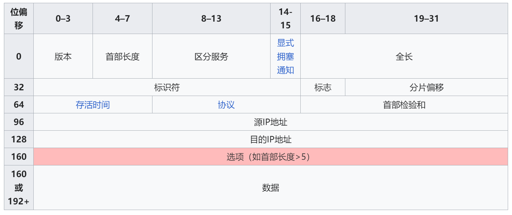

IP协议（Internet Protocol，互联网协议）是网络层的核心协议，负责在不同主机之间传输数据包。IP协议的主要版本有IPv4和IPv6，它们分别定义了不同的地址空间和报文格式。以下是对IP协议的详细介绍：

### IP协议的主要特性

1. **无连接**
   - IP协议是无连接的协议，每个数据包（称为IP数据报）独立传输，不依赖于之前或之后的数据包。
2. **不可靠传输**
   - IP协议不保证数据包的可靠传输，数据包可能在传输过程中丢失、重复或乱序到达。可靠性由上层协议（如TCP）来保证。
3. **分片与重组**
   - 如果数据包过大而无法通过链路层传输，IP协议可以将其分片（Fragmentation）为多个较小的片段，并在目的地重组（Reassembly）。
4. **路由选择**
   - IP协议负责数据包从源地址到目的地址的路由选择，通过路由器实现跨网络的数据传输。

### IPv4协议

#### IPv4报文格式

IPv4报文由首部和数据部分组成，首部的结构如下：

- **版本（Version）**：IPv4版本为4。
- **头部长度（IHL）**：IP首部的长度，以4字节为单位。
- **区分服务（DSCP）**：用于区分不同的服务类型。
- **总长度（Total Length）**：整个IP数据报的长度，包括首部和数据部分。
- **标识（Identification）**：唯一标识数据报，用于分片和重组。
- **标志（Flags）**：用于控制分片，包括是否允许分片和最后一个片段。
- **分片偏移（Fragment Offset）**：指示片段在原始数据报中的位置。
- **生存时间（TTL）**：数据报在网络中的最大存活时间，每经过一个路由器减1，减少到0时丢弃数据报。
- **协议（Protocol）**：指示使用的传输层协议，如TCP（6）、UDP（17）。
- **首部校验和（Header Checksum）**：用于检验IP首部的错误。
- **源地址（Source Address）**：发送方的IP地址。
- **目标地址（Destination Address）**：接收方的IP地址。
- **选项和填充（Options and Padding）**：可选字段，用于扩展功能。
- **数据（Data）**：实际传输的数据。

### IPv6协议

IPv6是IPv4的升级版本，主要解决了IPv4地址空间不足的问题，并改进了许多其他方面。

#### IPv6报文格式

IPv6报文由基础首部和数据部分组成，基础首部的结构如下：

- **版本（Version）**：IPv6版本为6。
- **流量类别（Traffic Class）**：类似于IPv4的区分服务字段，用于区分不同的服务类型。
- **流标签（Flow Label）**：用于标识数据流，便于路由器对数据流进行特殊处理。
- **负载长度（Payload Length）**：不包括基础首部的负载长度。
- **下一个头部（Next Header）**：指示下一个扩展头部或传输层协议。
- **跳数限制（Hop Limit）**：类似于IPv4的TTL字段，表示数据包可以经过的最大路由数。
- **源地址（Source Address）**：发送方的IPv6地址。
- **目标地址（Destination Address）**：接收方的IPv6地址。
- **数据（Data）**：实际传输的数据。

### IP地址

#### IPv4地址

- IPv4地址为32位，通常表示为四个十进制数，每个数值范围为0到255，用点分隔（如192.168.1.1）。
- IP地址分为五类：A类、B类、C类、D类（组播）、E类（实验）。

#### IPv6地址

- IPv6地址为128位，通常表示为八组十六进制数，每组由冒号分隔（如2001:0db8:85a3:0000:0000:8a2e:0370:7334）。
- 支持更大的地址空间，解决IPv4地址枯竭的问题。

### IP路由

- IP协议通过路由器进行路由选择，路由器根据目的地址选择最佳路径将数据包传输到下一跳。
- 路由表（Routing Table）存储路由信息，包含目的地址、下一跳地址和接口信息。

### IP分片与重组

- 当数据包大于链路层的最大传输单元（MTU）时，IP协议会将数据包分片进行传输。
- 每个片段包含原始数据包的一部分，并在IP头部中包含分片信息。
- 接收方在接收到所有片段后，根据分片信息将其重组为原始数据包。

### 总结

IP协议是互联网的基石，负责数据包在不同网络间的传输。IPv4和IPv6各自有不同的特性和应用场景，随着互联网的发展，IPv6逐渐成为主流。IP协议的无连接、不可靠传输特点需要通过其他协议（如TCP）来保证数据的可靠性和有序性。