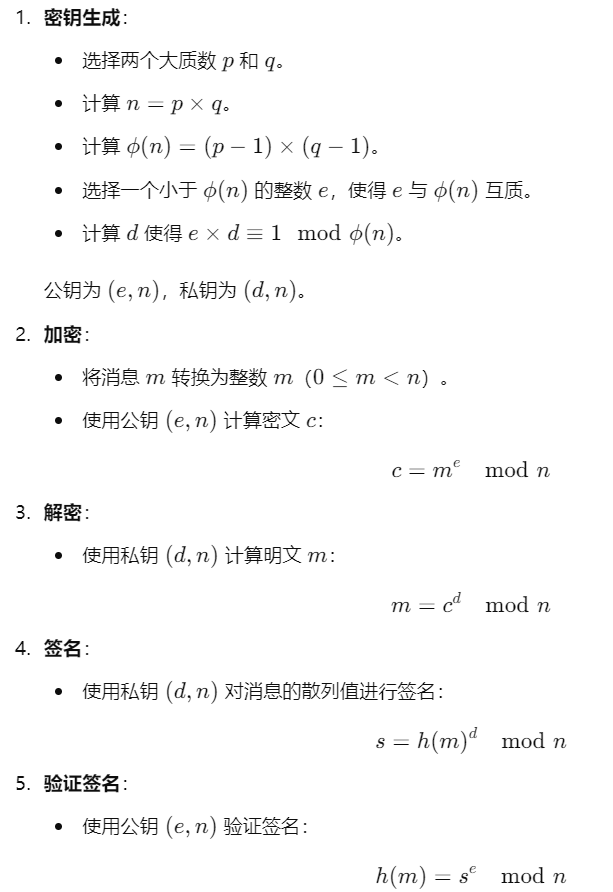
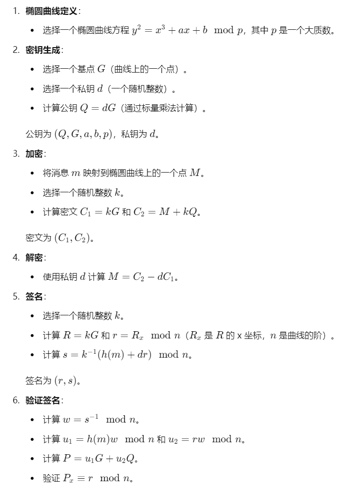

# TLS (Transport Layer Security) 

1.3 是一个用于在两个通信应用程序之间提供隐私和数据完整性的协议。TLS 1.3 是 TLS 协议的最新版本，相比于 TLS 1.2，TLS 1.3 提供了更高的安全性和更高的性能。以下是对 TLS 1.3 协议的详细介绍：

### 1. 概述

TLS 1.3 设计的目标是提高安全性和性能，减少握手时的延迟。它简化了协议，减少了攻击面，并使用更强的加密算法。

### 2. 主要特点

#### 简化的握手流程

TLS 1.3 的握手过程大幅简化，相比 TLS 1.2，有以下主要变化：

- **减少往返次数 (RTT)**: 默认情况下，握手只需要一次往返 (1-RTT) 完成。
- **0-RTT 握手**: 支持在某些条件下的 0-RTT 握手，允许客户端在握手的第一个消息中发送数据。这可以显著减少延迟，但会带来一定的重放攻击风险。

#### 更强的加密算法

TLS 1.3 移除了已知不安全的和过时的加密算法，只保留强加密：

- **AEAD 算法**: 只支持 AEAD（Authenticated Encryption with Associated Data）模式的加密算法，如 AES-GCM 和 ChaCha20-Poly1305。
- **PFS (Perfect Forward Secrecy)**: 所有握手都必须支持前向保密性，使用椭圆曲线 Diffie-Hellman (ECDHE) 或普通 Diffie-Hellman (DHE) 密钥交换。

#### 更简化的协议

TLS 1.3 移除了许多不再需要的功能和选项：

- **移除 RSA 密钥交换**: 不再支持 RSA 密钥交换，只支持（椭圆曲线）Diffie-Hellman 密钥交换。
- **移除静态 Diffie-Hellman**: 不再支持静态 DH 密钥交换。
- **移除冗余消息**: 减少了握手过程中的消息种类和数量。

### 3. 握手过程

TLS 1.3 握手过程分为两种：全握手（1-RTT）和恢复握手（0-RTT）。

#### 1-RTT 握手

1. **ClientHello**: 客户端发送支持的密码套件、加密算法、密钥交换参数和其他参数。
2. **ServerHello**: 服务器响应客户端，选择密码套件和密钥交换参数。
3. **密钥交换**: 服务器发送 Diffie-Hellman 参数和自己的证书。
4. **Finished**: 双方交换 Finished 消息，确认握手完成，并开始加密通信。

#### 0-RTT 握手

0-RTT 握手允许客户端在 ClientHello 消息中发送数据，但需要满足特定条件，如先前已成功握手并缓存了会话状态。

### 4. 安全增强

- **移除弱算法**: 不再支持 RC4、MD5、SHA-1 等已知不安全的算法。
- **改进的密钥派生**: 使用 HMAC 和 HKDF (HMAC-based Extract-and-Expand Key Derivation Function) 进行更安全的密钥派生。
- **加密握手消息**: 握手过程中传输的敏感信息（如证书）默认加密，保护双方隐私。

### 5. 性能提升

- **减少延迟**: 1-RTT 和 0-RTT 握手显著减少延迟，提高连接建立速度。
- **会话恢复**: 支持会话恢复，减少握手开销。

# RSA

### 概述

RSA 是一种基于大数因子分解难题的公钥加密算法，由 Ron Rivest、Adi Shamir 和 Leonard Adleman 于1977年提出。RSA 可以用于加密和数字签名。

### 工作原理

RSA 的安全性依赖于因数分解的计算困难性。它的基本步骤如下：

# 椭圆曲线密码学 (ECC)

### 概述

ECC 是基于椭圆曲线数学结构的公钥加密算法。ECC 由 Neal Koblitz 和 Victor Miller 于1985年独立提出。ECC 提供与 RSA 相同的功能，但密钥长度更短，效率更高。

### 工作原理

ECC 的安全性依赖于椭圆曲线离散对数问题（ECDLP）的计算困难性。ECC 的基本步骤如下：

# Diffie-Hellman（DH）

密钥交换协议是一种允许两个参与者在不安全的信道上安全地共享密钥的方法。椭圆曲线 Diffie-Hellman（ECDH 或 ECDHE）是其椭圆曲线版本，提供了更高的安全性和效率。以下是对 ECDHE 的详细介绍。

## 概述

ECDHE（Elliptic Curve Diffie-Hellman Ephemeral）是 ECDH 的变种，使用临时密钥（ephemeral keys）进行每次密钥交换，从而提供前向保密性（Perfect Forward Secrecy，PFS）。这意味着即使长期密钥泄露，也无法解密之前的会话。

## 工作原理

### 椭圆曲线简介

在 ECDHE 中，椭圆曲线 EEE 定义为一个方程： y2=x3+ax+bmod  py^2 = x^3 + ax + b \mod py2=x3+ax+bmodp 其中，ppp 是一个大质数，aaa 和 bbb 是定义曲线的常数，确保曲线是非奇异的（即没有重复根）。

### 密钥交换过程

ECDHE 密钥交换过程包括以下步骤：

1. **选择公共参数**：

   - 选择一个合适的椭圆曲线 EEE 和一个基点 GGG（曲线上的一个点），这些参数是公知的。

2. **生成密钥对**：

   - 每个参与者（例如 Alice 和 Bob）生成一个临时的私钥和对应的公钥。
   - Alice 选择一个私钥 aaa，并计算公钥 A=aGA = aGA=aG。
   - Bob 选择一个私钥 bbb，并计算公钥 B=bGB = bGB=bG。

3. **交换公钥**：

   - Alice 和 Bob 交换各自的公钥 AAA 和 BBB。

4. **计算共享密钥**：

   - Alice 使用 Bob 的公钥 BBB 和自己的私钥 aaa 计算共享密钥： S=aB=a(bG)=(ab)GS = aB = a(bG) = (ab)GS=aB=a(bG)=(ab)G
   - Bob 使用 Alice 的公钥 AAA 和自己的私钥 bbb 计算共享密钥： S=bA=b(aG)=(ab)GS = bA = b(aG) = (ab)GS=bA=b(aG)=(ab)G

   由于 (ab)G(ab)G(ab)G 对 Alice 和 Bob 来说是相同的，因此他们共享了同一个密钥 SSS。

### 安全性

ECDHE 的安全性基于椭圆曲线离散对数问题（ECDLP）的困难性，即给定点 PPP 和 Q=kPQ = kPQ=kP，很难计算出标量 kkk。这使得攻击者即使知道公钥 AAA 和 BBB，也无法轻易计算出共享密钥 SSS。

### 前向保密性

ECDHE 的一个重要特性是前向保密性（PFS）。由于每次会话使用不同的临时密钥，即使一个会话的密钥泄露，也无法解密之前的会话。