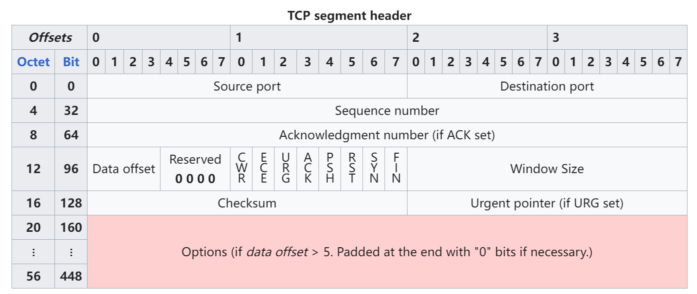

TCP（Transmission Control Protocol，传输控制协议）是传输层的一种主要协议，它提供可靠、面向连接的服务，保证数据在网络中的传输准确无误。以下是对TCP协议的详细介绍：

### TCP的主要特性

1. **面向连接**
   - 在数据传输之前，通信双方必须建立连接。这是通过三次握手（Three-way Handshake）完成的，确保双方都准备好进行数据传输。
2. **可靠传输**
   - TCP确保数据包的有序传输和数据完整性。它通过序列号、确认号、重传机制和窗口控制来保证数据的可靠性。
3. **全双工通信**
   - TCP支持全双工通信，允许双方同时发送和接收数据。
4. **流量控制**
   - 通过滑动窗口（Sliding Window）机制，TCP实现了流量控制，防止发送方发送的数据超过接收方的处理能力。
5. **拥塞控制**
   - TCP采用慢启动（Slow Start）、拥塞避免（Congestion Avoidance）、快速重传（Fast Retransmit）和快速恢复（Fast Recovery）等机制来防止网络拥塞。

### TCP报文格式

TCP报文由首部和数据部分组成，其中首部的结构如下：

- **源端口和目标端口**：分别表示发送方和接收方的端口号。

- **序列号**：表示该报文段的数据在整个数据流中的位置。

- **确认号**：表示期望接收的下一个字节的序列号。

- **数据偏移**：表示TCP报文段的首部长度。

- **保留**：保留为未来使用，通常置0。

- 控制标志

  ：包括URG、ACK、PSH、RST、SYN、FIN等，用于控制连接状态和数据传输。

  - **URG**：紧急指针有效。
  - **ACK**：确认号有效。
  - **PSH**：接收方应尽快将报文交给应用层。
  - **RST**：重置连接。
  - **SYN**：同步序列号，用于建立连接。
  - **FIN**：发送方完成发送任务，用于释放连接。

- **窗口大小**：用于流量控制，表示接收方当前的接收能力。

- **校验和**：用于检验数据在传输过程中是否出现错误。

- **紧急指针**：指出紧急数据的结束位置。

- **选项和填充**：用于扩展TCP功能，填充部分用于确保首部长度是4的倍数。

### TCP连接管理

#### 三次握手（Three-way Handshake）

1. **第一次握手**：客户端发送一个SYN（同步序列号）报文段到服务器，表示客户端希望建立连接，并且告知客户端的初始序列号。
2. **第二次握手**：服务器收到SYN报文段后，回复一个SYN-ACK（同步-确认）报文段，表示同意建立连接，并告知服务器的初始序列号和确认客户端的序列号。
3. **第三次握手**：客户端收到SYN-ACK报文段后，发送一个ACK（确认）报文段给服务器，确认服务器的序列号。此时，连接建立完成。

#### 四次挥手（Four-way Handshake）

1. **第一次挥手**：客户端发送一个FIN（结束）报文段，表示客户端希望断开连接。
2. **第二次挥手**：服务器收到FIN报文段后，回复一个ACK报文段，表示已收到断开连接请求。
3. **第三次挥手**：服务器发送一个FIN报文段，表示服务器也希望断开连接。
4. **第四次挥手**：客户端收到FIN报文段后，回复一个ACK报文段，表示确认断开连接。此时，连接断开完成。

### TCP的工作过程

1. **数据传输**：在连接建立后，数据可以通过TCP流式传输。TCP将数据分割成适当大小的报文段，通过网络发送。
2. **错误检测与重传**：TCP使用校验和来检测报文段中的错误，如果接收方检测到错误，则会请求重传。
3. **数据排序**：TCP保证数据按序到达，即使报文段是乱序到达的，TCP也会根据序列号重新排序。
4. **流量控制与拥塞控制**：通过滑动窗口和拥塞控制算法，TCP确保网络不会过载，并根据网络状态动态调整传输速度。

### 应用场景

TCP适用于需要可靠传输的应用，如：

- **Web浏览**：HTTP/HTTPS
- **电子邮件**：SMTP、POP3、IMAP
- **文件传输**：FTP
- **远程登录**：SSH、Telnet

TCP在保障数据传输的可靠性和稳定性方面发挥着重要作用，广泛应用于各种网络通信中。