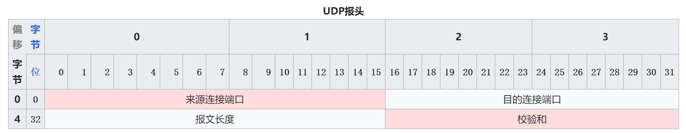

UDP（User Datagram Protocol，用户数据报协议）是传输层的另一种主要协议，与TCP不同，UDP提供一种不可靠、无连接的传输服务，适用于对速度和效率要求较高但对可靠性要求不高的应用场景。以下是对UDP协议的详细介绍：

### UDP的主要特性

1. **无连接**
   - UDP是无连接的协议，数据传输之前不需要建立连接。这意味着它没有TCP的三次握手过程，发送数据时直接进行传输。
2. **不可靠传输**
   - UDP不保证数据的可靠传输，不提供重传机制。如果数据在传输过程中丢失或出错，UDP不会尝试重新发送。
3. **无序传输**
   - UDP报文段（数据报）可能会乱序到达，协议本身不保证数据的顺序。
4. **轻量级**
   - UDP的报文头部开销小，结构简单，适合对传输效率要求较高的应用。
5. **无拥塞控制**
   - UDP没有内置的拥塞控制机制，适合实时性要求高的应用，但也容易造成网络拥塞。

### UDP报文格式

UDP报文由首部和数据部分组成，首部的结构如下：

- **源端口**：发送方的端口号。
- **目标端口**：接收方的端口号。
- **长度**：UDP报文的总长度，包括首部和数据。
- **校验和**：用于检验数据在传输过程中是否出现错误（可选）。
- **数据**：实际传输的数据。

### UDP的工作过程

1. **数据报创建**
   - 应用程序将数据传递给UDP层，UDP层将数据封装成数据报。
2. **发送数据报**
   - UDP层将数据报发送到网络层，网络层再将数据报传输到目标主机。
3. **接收数据报**
   - 目标主机的网络层接收到数据报后，将其传递给UDP层，UDP层再将数据传递给相应的应用程序。

### UDP的应用场景

由于UDP的无连接和不可靠特性，它适用于对实时性要求高、允许数据丢失的应用，如：

1. **视频流和音频流**
   - 如IPTV、VoIP（Voice over IP）、在线游戏。这些应用要求低延迟，即使有少量的数据丢失，也不会严重影响用户体验。
2. **DNS（Domain Name System）查询**
   - DNS请求和响应通常是单个数据报，使用UDP可以快速查询域名解析。
3. **DHCP（Dynamic Host Configuration Protocol）**
   - 用于动态分配IP地址，发送请求和接收响应都使用UDP。
4. **简单的网络协议**
   - 如SNMP（Simple Network Management Protocol），用于网络设备的监控和管理。

### UDP与TCP的比较

- **连接方式**
  - TCP：面向连接，需建立和释放连接（三次握手和四次挥手）。
  - UDP：无连接，不需要建立连接，直接传输数据。
- **可靠性**
  - TCP：提供可靠传输，保证数据顺序和完整性。
  - UDP：不保证可靠性，可能会出现数据丢失或乱序。
- **流量控制和拥塞控制**
  - TCP：内置流量控制和拥塞控制机制。
  - UDP：无流量控制和拥塞控制机制。
- **报文头部开销**
  - TCP：报文头部较复杂，开销较大。
  - UDP：报文头部简单，开销小。

### 总结

UDP协议以其简单高效的特点，在需要快速传输、低延迟的应用中得到了广泛应用。尽管其不提供可靠性保证，但对于某些实时应用来说，这是一个优势，因为它减少了传输的延迟和开销。UDP与TCP互为补充，共同满足了各种网络应用的需求。