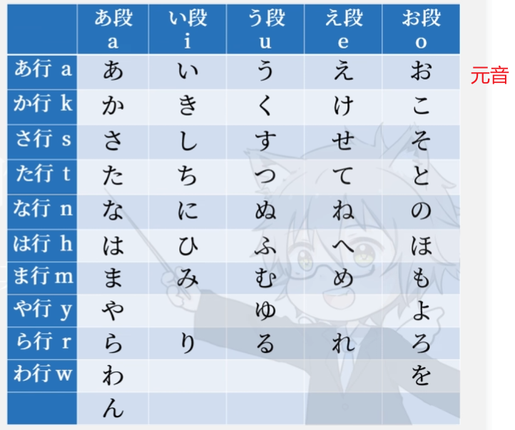

# 第一节 五十音

## 一、五十音图

## 二、元音行

（类似英语大小写）平假名：平常使用的日本词  片假名：外来词，如德语法语等

## 三、K行

## 四、S行

SHI发XI音  SU发Si Su之间的音

## 五、T行

## 六、N行

## 七、H行

## 八、M行

## 九、Y行

## 十、R行

## 十一、W行

# 第二节  日语声调

## 一、声调的标记方法

**1.第一个音和第二个音不是同音**

**2.出现降音就不会升回去**

**3.在第几个音出现高-低，就是几型**（上面是4，4，4，4，0，3型）

## 二、0和2型区别

加助词后通过读法区分，不加助词两个字读没区别

# 第三节 四种音

## 一、浊音

**在右上角加两个点，代表浊化**

### 1、K行浊化变G

### 2、S行浊化变Z

### 3、T浊化变D

### 4、H浊化变B

### 5、H半浊变P

## 二、长音

任何一个字不可能读长音，只有两个字在一起可能会。

片假名会给符号标出—，平假名需要推出

### 1、a段假名+a

浊音也算

### 2、i段假名+i

### 2、u段假名+u

### 2、e段假名+e/i

### 2、o段假名+o/u

## 三、促音

不发音，停一拍。

小一号的TSU

## 四、拗音

两个字占一拍

KI**YA**  KI**YU** KI**YO** 

GI

SHI ZI

CHI DI

NI 

HI

BI PI

mi ri

12*3=36个
