# 第一节 单词

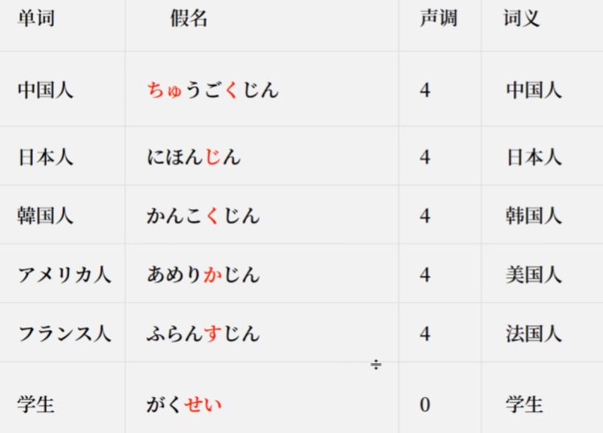

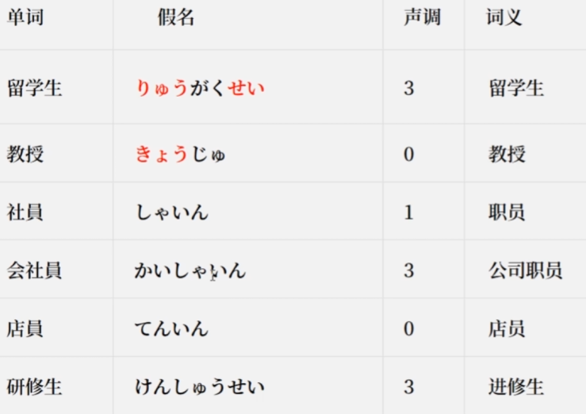

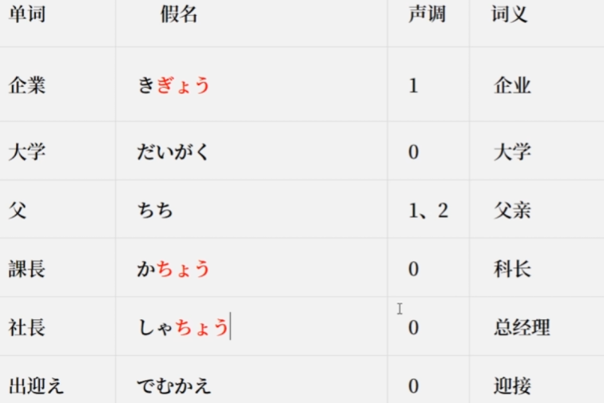

......

# 第二节 语法

## 一、什么是什么。

  如  **A ha B de su** （句子中ha作为提示助词读wa，提示主题）

A ha是主语，B de su是谓语，de su记为是

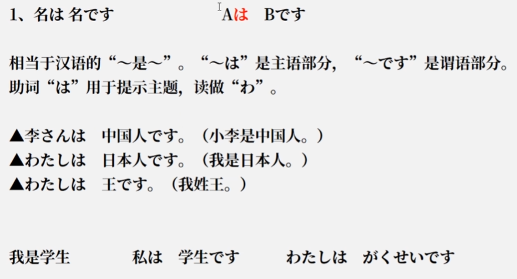

## 二、什么不是什么。

如 A ha B    de  ha    a ri ma se n

zi ya可以和 de ha替换，前者通常口语一点。

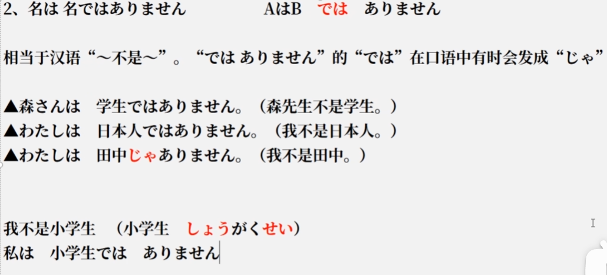

## 三、什么是什么吗？

A ha    B  de  su ka

回答  ha i （是）或者 i i e（不是）

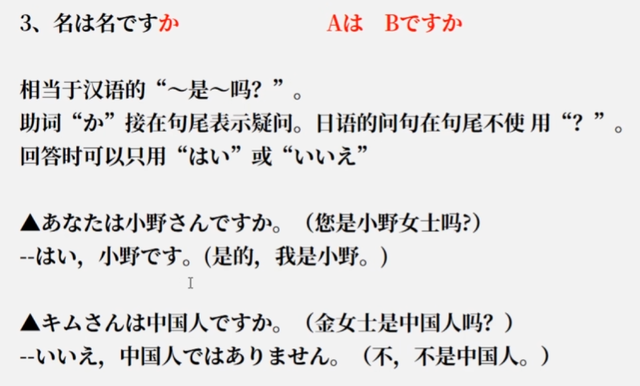

## 四、一半情况下 的。

A  NO B    A的B

NO助词，连接名词和名词。

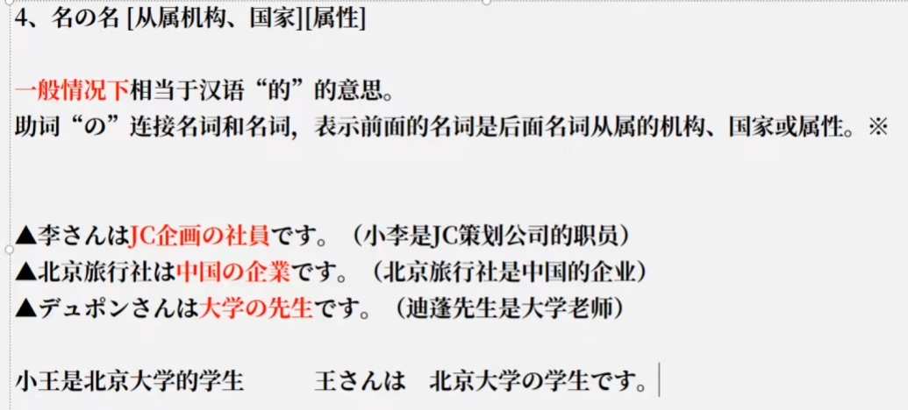

# 第三节   表达与词语讲解

## 一 人称

1.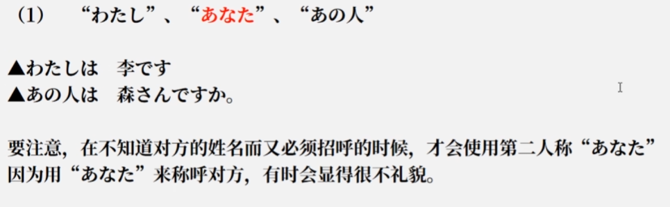

2.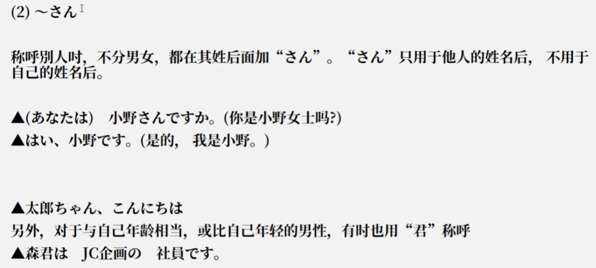

## 二  省略

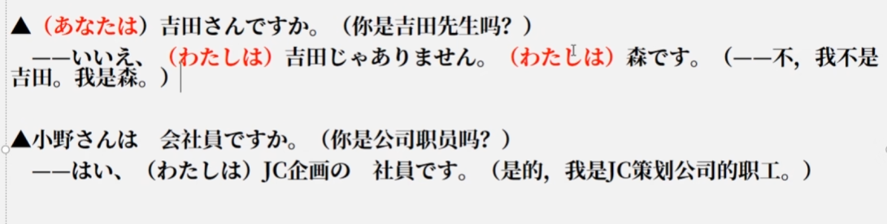

## 三 惊叹

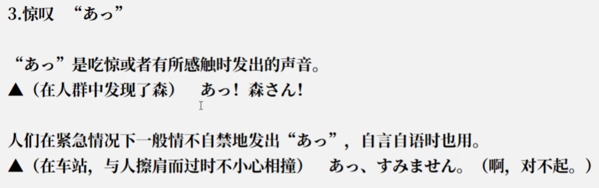

## 四 寒暄

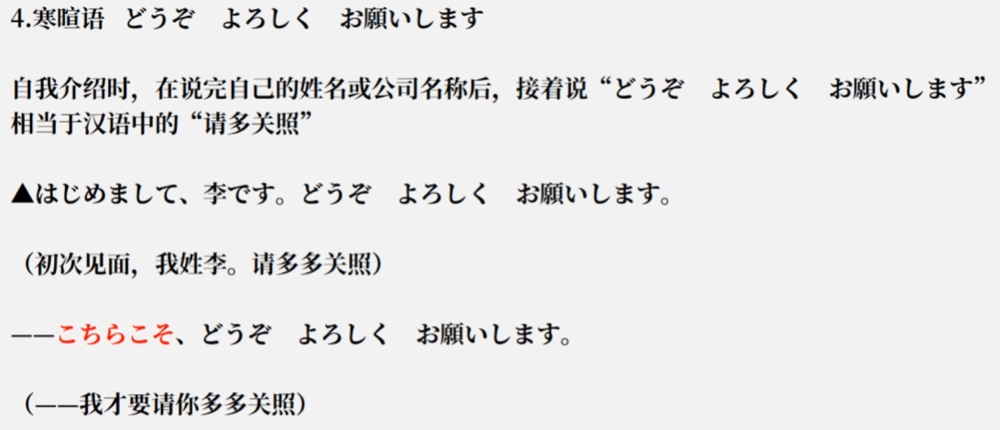